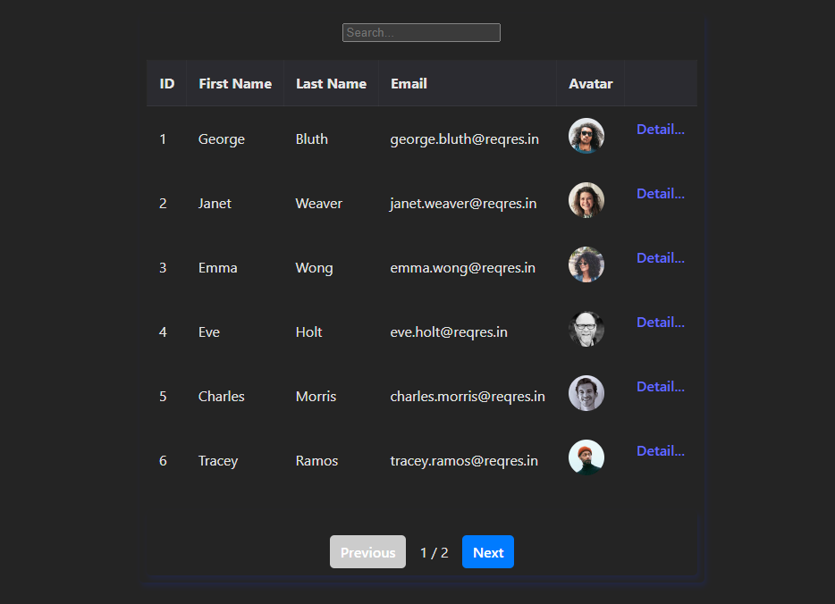

# Proyecto de Gestión de Usuarios con Vue 3 y Pinia

Este es un proyecto para prueba tecnica de Apping Lab, que utiliza Vue 3 y Pinia para crear una aplicación web de gestión de usuarios. La aplicación muestra una lista de usuarios y permite la navegación a los detalles de cada usuario.



## Tecnologías Utilizadas

- Vue 3: Un popular marco de trabajo de JavaScript para construir interfaces de usuario interactivas y reactivas.

- Pinia: Una biblioteca de gestión de estado inspirada en Vuex para aplicaciones Vue 3.

- Vue Router: Para la navegación entre las diferentes vistas de la aplicación.

- HTML5 y CSS3: Para la estructura y el diseño de la interfaz de usuario.

## Características Principales

- Visualización de una lista de usuarios con detalles básicos.
- Navegación entre la lista de usuarios y los detalles individuales de cada usuario.
- Paginación de la lista de usuarios para una mejor experiencia de usuario.
- Carga asincrónica de datos desde una API externa (ReqRes.in) para simular un entorno real.
- Busqueda de usuarios por nombre o por email.
- Paginacion reactiva que muestra 6 usuarios por pagina.

## Instalación y Uso

1. Clona este repositorio en tu máquina local:

   ```shell
   git clone https://github.com/davemmWeb/prueba-appingLab.git

   ```

2. Ve al directorio de tu proyecto

   ```shell
   cd tuproyecto

   ```

3. Installa las dependencias

   ```shell
   npm o pnpm install

   ```

4. Inicia la aplicacion

   ```shell
   npm run dev

   ```

5. Abre tu navegador y accede a la aplicacion en `http://localhost:5173/`
